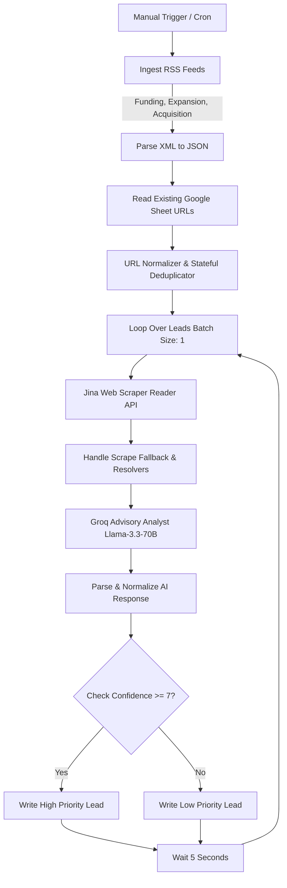
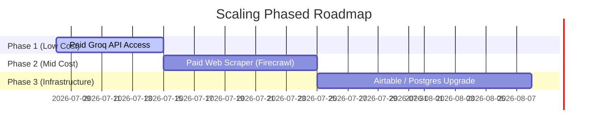

# Dugain Advisors — AI Automation Intern Assignment Documentation
## Automated Lead Generation & Regulatory Qualification Workflow

This repository contains the complete submission for the Dugain Advisors AI Automation Intern shortlisting assignment. It features a fully automated, production-grade **n8n workflow** that ingests raw business signals, scrapes article content, performs non-trivial corporate finance and regulatory qualification using a free LLM, and logs structured, actionable insights into Google Sheets.

---

## 📋 Table of Contents
1. [Workflow Architecture](#-workflow-architecture)
2. [Data Source & Buying Signals Justification](#-data-source--buying-signals-justification)
3. [AI Qualification & Non-Trivial Logic](#-ai-qualification--non-trivial-logic)
4. [Google Sheets Database Schema](#-google-sheets-database-schema)
5. [Technical Self-Awareness & Scale Limitations](#-technical-self-awareness--scale-limitations)
6. [Paid Upgrade Roadmap & Cost-Benefit Analysis](#-paid-upgrade-roadmap--cost-benefit-analysis)
7. [Setup & Ingestion Guide](#-setup--ingestion-guide)

---

## 🏗️ Workflow Architecture

The workflow is structured into four functional modules, built entirely with native n8n nodes and custom JavaScript blocks to ensure robust state management and rate-limit compliance.



### Module 1: Ingestion & Stateful Deduplication
*   **Feeds Ingested**: Google News RSS feeds targeting startup funding rounds, geographic business expansion, and M&A events in India.
*   **Stateful Deduplication**: Cross-references incoming links with Column L (Source URL) of the target Google Sheet and tracks URLs processed in the current run using a normalization helper (removing protocols, query parameters, and trailing slashes). This prevents duplicate writes and redundant LLM spending.

### Module 2: Scrape, Clean & Fallback Handler
*   **Jina Reader Scraper**: Converts full-text web pages into clean markdown.
*   **Google Redirect Resolver**: Resolves Google News tracker redirects to final destination URLs before querying the scraper, bypassing redirection failures.
*   **RSS Fallback**: In case of Cloudflare page blocks, paywalls, or scraper timeouts, the system automatically falls back to using the RSS title and description snippet. The workflow *never* errors out.

### Module 3: AI-Powered Advisory Analyst (Non-Trivial Qualification)
*   **LLM Model**: Groq `llama-3.3-70b-versatile` (fully free tier access).
*   **System Prompt Persona**: Acts as a Senior Corporate Finance, Legal, and M&A Partner at Dugain Advisors.
*   **Task**: Extracts entities (company, founders, stage), classifies events, evaluates regulatory/legal obligations under Indian law, assigns a confidence score (1-10), and produces a highly detailed, professional qualification reasoning text.

### Module 4: Routing & Google Sheets Logging
*   **Priority Router**: Splits leads at a confidence rating threshold of `7` to keep high-priority, hot leads separate from lower-confidence watchlist items.
*   **Database Writes**: Writes structured columns using explicit n8n v4 column pairing schemas.

---

## 🎯 Data Source & Buying Signals Justification

Rather than using static database lists (e.g., Apollo, ZoomInfo) which represent stale contact data, this workflow targets **real-time corporate events** that act as **high-intent buying signals** for Dugain Advisors' legal and transactional services:

| Buying Signal | Target Event | Immediate Regulatory/Legal Pain Point (Indian Law) | Relevant Dugain Service |
| :--- | :--- | :--- | :--- |
| **Funding Round** | Startup raises Seed, Pre-Series A, or Series A capital. | <ul><li>Income Tax Act Section 56(2)(viib) share valuation requirements.</li><li>RBI FEMA compliance (Form FC-GPRS filing within 30 days of inbound FDI).</li><li>ESOP pool creation/expansion and cap table restructuring.</li></ul> | **Startup Advisory, Share Valuations, FEMA/RBI Filings** |
| **Business Expansion** | Foreign company incorporates an Indian subsidiary or opens a new office in India. | <ul><li>FDI reporting requirements and FEMA clearances.</li><li>Incorporation compliance, corporate tax registration, and Virtual CFO setup.</li><li>Board resolutions and secretarial compliance files.</li></ul> | **India Entry Services, Virtual CFO, Secretarial Compliance** |
| **Acquisition / M&A** | Company is acquired, merged, or undergoes a buyout. | <ul><li>Comprehensive financial and legal due diligence audits.</li><li>Regulatory share valuations and exit tax structuring.</li><li>Drafting complex Shareholder Agreements (SHA) and Share Purchase Agreements (SPA).</li></ul> | **M&A Support, Financial Due Diligence, Share Valuations** |

> [!NOTE]
> **Why RSS over alternatives?**
> Google News RSS provides real-time public announcements without requiring expensive search API keys. By filtering queries specifically to India-based business events, it exposes exact windows of opportunity when companies *must* legally hire advisors (e.g., the 30-day RBI filing window post-funding).

---

## 🤖 AI Qualification & Non-Trivial Logic

The core differentiator of this workflow is the **Groq Advisory Analyst** node, which acts as a senior advisory partner rather than a simple text parser. 

### What the AI Step Actually Does
1.  **Extracts Structured Data**: Safely extracts the target company name, founders, stage, event context, and publishing date from unstructured markdown.
2.  **Identifies Indian Regulatory Requirements**: Maps the event to specific filings under the **Companies Act, 2013**, **Income Tax Act, 1961**, and **FEMA regulations (RBI)**.
3.  **Generates Professional Qualification Reason**: Instead of generating generic outreach copy, it explains the exact compliance obligations the target company now faces.
4.  **Performs Risk Assessment**: Identifies potential barriers such as small deal sizes, strict RBI rules on foreign equity, or high sectoral regulatory compliance (e.g., Fintech/Edtech).

### Real Output Example
For a news article reporting: *"Fintech startup PayZippy raises $5 Million from US-based Sequoia India to expand its merchant payment gateway network..."*

The AI generates the following structured assessment:
```json
{
  "companyName": "PayZippy",
  "founders": null,
  "businessEvent": "Raised $5 Million funding from Sequoia India",
  "companyStage": "Growth Stage (Series A equivalent)",
  "recommendedServices": "FEMA Compliance, Share Valuation, Virtual CFO, Corporate Tax Compliance",
  "confidence": 9,
  "leadQuality": "High",
  "qualificationReason": "PayZippy is receiving inbound Foreign Direct Investment (FDI) from a US-based fund. Under Indian FEMA regulations, the company must file Form FC-GPRS with the Reserve Bank of India (RBI) within 30 days of issuing shares. Additionally, issuing shares to a venture fund requires a Fair Value Share Valuation Certificate under Section 56(2)(viib) of the Income Tax Act. Given their expansion plans, their corporate tax compliance and Virtual CFO needs will scale immediately.",
  "riskFactors": "Fintech sector is heavily monitored by RBI; compliance requirements may shift. The source article did not specify the exact share premium pricing.",
  "nextAdvisoryOpportunity": "RBI FC-GPRS Filing & Section 56 Valuation Certificate",
  "articleDate": "2026-07-07",
  "sourceUrl": "https://news.google.com/..."
}
```

---

## 📊 Google Sheets Database Schema

The Google Sheets output is designed to be fully actionable by a non-technical sales representative or executive. The sheet contains the following columns:

1.  **Company Name**: Name of the target entity.
2.  **Founders**: List of founders for personalized outreach context.
3.  **Business Event**: Simple explanation of what triggered the lead.
4.  **Company Stage**: Visual classification of firm size/stage.
5.  **Recommended Services**: Curated list of services Dugain should pitch.
6.  **Lead Quality**: `High` / `Medium` / `Low` classification.
7.  **Confidence**: Score from `1` (low) to `10` (high).
8.  **Qualification Reason**: Detailed legal/tax rationale (the "Hook" for sales).
9.  **Risk Factors**: Cautions regarding the lead.
10. **Next Advisory Opportunity**: The immediate call-to-action to propose on a sales call.
11. **Article Date**: Date the event was published.
12. **Source URL**: Direct link to the source article.
13. **Processed Timestamp**: Execution date and time.

---

## 💡 Technical Self-Awareness & Scale Limitations

Operating a production workflow on a **free tier** introduces structural failure points that must be proactively designed for.

### Where This Workflow Breaks at Scale
1.  **Groq API Rate Limits (RPM/TPM)**: The Groq free tier enforces strict rate limits (e.g., 30 Requests Per Minute for Llama-3.3-70B). Processing 50 leads simultaneously will trigger a `429 Too Many Requests` error.
    *   *Solution implemented*: Built a sequential loop (`Loop Over Leads` with batch size = 1) combined with a `Wait 5 Seconds` node. This spaces requests out to ~10-12 RPM, comfortably below the rate limit.
2.  **Scraper Paywalls & Cloudflare Blocks**: Premium news sites (e.g., LiveMint, Economic Times) actively block automated requests from basic web scrapers.
    *   *Solution implemented*: Implemented a clean fallback system. If Jina Scraper returns an HTTP block status or content shorter than 300 characters, the workflow automatically bypasses the scrape and qualifies using the RSS snippet content.
3.  **Google Sheets Concurrency Limit**: Under heavy concurrent runs, Google Sheets can occasionally lock or fail on rapid append operations.
    *   *Solution implemented*: Sequential iteration ensures sheets are updated one-by-one rather than in a parallel burst.

---

## 🚀 Paid Upgrade Roadmap & Cost-Benefit Analysis

If Dugain Advisors decides to scale this workflow to parse thousands of articles daily and integrate with a CRM, we recommend the following phased upgrades:



### 1. Paid Groq API Access
*   **Cost**: Pay-as-you-go (~$0.59 per 1 Million input tokens for Llama 3.3 70B). Average monthly cost for 1,000 runs: **<$5.00/month**.
*   **Benefit**: Raises rate limits from 30 RPM to 1000+ RPM. Allows removing the `Wait 5 Seconds` delay, speeding up ingestion by **500%**.

### 2. Paid Scraping API (e.g., Firecrawl or ScrapingBee)
*   **Cost**: ~$29.00/month.
*   **Benefit**: Rotates residential proxies and solves JS/Cloudflare challenges automatically. Ensures **99.9%** scrapability of premium financial news portals (like LiveMint, Economic Times), eliminating the need for RSS Fallbacks.

### 3. Database Layer Upgrade (Postgres or Airtable)
*   **Cost**: Free to $20.00/month.
*   **Benefit**: Replaces Google Sheets to support complex relational querying, robust deduplication indexing, and handles higher concurrent transactions without API lockups.

---

## ⚙️ Setup & Ingestion Guide

Follow these steps to import and execute the workflow on your local or cloud n8n instance:

### Prerequisites
1.  A running **n8n** instance (v1.0 or higher).
2.  A free **Groq API Key** (obtainable from [Groq Console](https://console.groq.com/)).
3.  A **Google Sheet** set up with the following header row in **Sheet1**:
    `Company Name | Founders | Business Event | Company Stage | Recommended Services | Lead Quality | Confidence | Qualification Reason | Risk Factors | Next Advisory Opportunity | Article Date | Source URL | Processed Timestamp`

### Step-by-Step Installation
1.  **Copy the JSON**: Copy the entire contents of [dugain_lead_workflow.json](file:///Users/ovaiskoite/dugain/dugain_assignment/dugain_lead_workflow.json).
2.  **Import to n8n**: Open your n8n dashboard, click **Add Workflow** -> **Import from JSON**, and paste the copied content.
3.  **Configure Environment Variables / Credentials**:
    *   Set the `GROQ_API_KEY` environment variable on your n8n host, **OR**
    *   Double-click the `Groq Advisory Analyst` HTTP Request node and replace `REPLACE_WITH_GROQ_API_KEY` in the headers expression with your actual API key:
        `"Authorization": "Bearer gsk_..."`
4.  **Connect Google Sheets**:
    *   Open both `Read Google Sheet URLs`, `Write High Priority Lead`, and `Write Low Priority Lead` nodes.
    *   Set up your Google Sheets OAuth2/Service Account credentials.
    *   Select your Google Spreadsheet from the dropdown list (replacing the `placeholder-sheet-id`).
5.  **Run the Workflow**: Click **Listen for Test Event** or manually trigger the workflow to see it run in real-time!